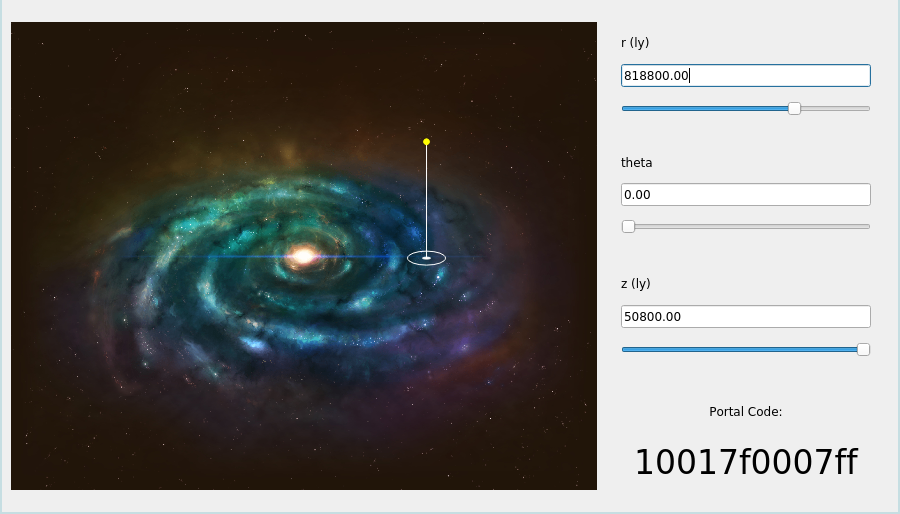

# Galactic Navigator

A tool to assist in navigating the galaxy in No Man's Sky.

-----------------------------

Galactic Navigator is a small program to be used with No Man's Sky. It allows you to choose a location within the galaxy using a cylindrical coordinate system, and preview how this location would appear on the in-game minimap. This enables you to visually find a particular location within the galaxy.

## Copyright

All original code in this repository is licensed under GNU GPL 3 (see [LICENSE](LICENSE)).

The author of this software is not affiliated with Hello Games.

No Man's Sky is property of Hello Games.

[mapHD.png](mapHD.png) comes from [https://galacticatlas.nomanssky.com/](https://galacticatlas.nomanssky.com/) and is property of Hello Games.
